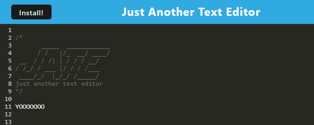

# 19 Progressive Web Applications (PWA): JATE (Just Another Text Editor)

## Description
  
This application allows you to easily take notes and save them without any need for an internet connection.
  
## Table of Contents (Optional)
  
 - [Installation](#installation)
 - [Usage](#usage)
 - [Credits](#credits)
 - [Features](#features)
 - [Questions](#questions)
  
## Installation
  
Left click the install button and you'll be prompted to install the application. Once finished
the application can be access via the shortcut you should now have on your desktop.
  
## Usage
  
To use this application, click [here](https://c19-text-editor.onrender.com). Once the page loads you'll be able to use it as a note taking application. If you feel so inclined you're also able to install the application. This application does not require an internet connection to use.

Example:

  
## Credits
  
Whoever wrote the starter code for this.

And of course, Ian Wolfe.
  
## Features
  
This project features express, concurrently, nodemon, babel, and webpack.

## Questions

For any questions about this project, please visit my [GitHub](https://github.com/enkw).
